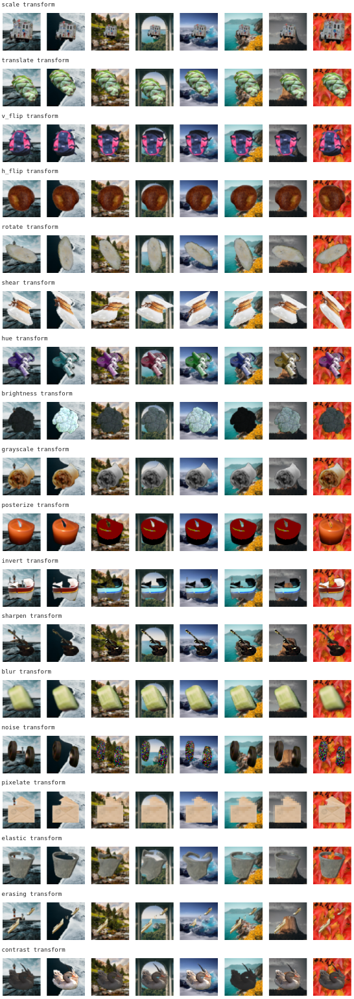

# Transforms-2D dataset

Transforms-2D is a family of synthetic image datasets that allows for precise control over which objects are present in images, as well as the transformations acting on them.

A Transforms-2D dataset $\mathcal{D}(O, T)$ is defined by a set of foreground objects $O$ and a set of transformations $T$, with associated distributions $P_O$ and $P_T$ over $O$ and $T$, respectively.
In addition, there is a set $B$ of background images with uniform distribution $P_B$, which is the same across all datasets in the family.
To sample an image from $\mathcal{D}(O, T)$, we sample an object $o \sim P_O$, a transformation $t \sim P_T$, and a background $b \sim B$, and then create an image as $b(t(o))$, where $t(o)$ is the transformed object and $b(.)$ denotes pasting onto the background $b$.
Each object $o \in O$ defines a class in the dataset, with each sample having $o$ as its class.
That means that each class is based on a single object prototype $o \in O$, and different instances of the same class are created by applying transformations from $T$ to the prototype.



## Foreground objects and background images

Each sample from a $\mathcal{D}(O, T)$ dataset consists of a transformed foreground object pasted onto a background image.
Foreground objects $O$ are a subset of 61 photographs of real-world objects, such as food and household items, vehicles, animals, etc.
Each object image has a transparency masks, such that it only contains the object and no background.
$P_O$ samples objects uniformly at random from $O$.
We use the same set $B$ of background images for each $\mathcal{D}(O, T)$, which are photographs of nature scenes, chosen uniformly at random from a set of 867 candidates.
The foreground and background images are based on the [SI-score dataset](https://github.com/google-research/si-score/).
In our experiments, we subsample images to have a resolution of 32 x 32 pixels, since this size provides enough detail for models to be able to distinguish between different objects, even with transformations applied to them, while allowing for faster iteration times in terms of training and evaluation.

The base images for the foreground objects and background images are available on the [Huggingface Hub](https://huggingface.co/datasets/tillspeicher/transforms_2d_base).

Transforms-2D can also be used with random foreground objects and background images.

## Transformations

There are 18 different types of transformations used to transform objects, split into three categories:

1. **Geometric:** translate, rotate, scale, vertical flip, horizontal flip, shear
2. **Photometric:** hue, brightness, grayscale, posterize, invert, sharpen
3. **Corruption:** blur, noise, pixelate, elastic, erasing, contrast
Datasets can use combinations of multiple transformations.

## Usage

Transforms-2D datasets are implemented as [PyTorch LightningDataModules](https://lightning.ai/docs/pytorch/stable/data/datamodule.html).
The easiest way to use them is via the utility functions in `./create.py` as follows:

```python
import transforms_2d as t2d

n_samples = 8
config = t2d.Transforms2DConfig(
    sampling_seed=483,
    img_size=64,
    n_training_samples=n_samples,
    n_val_samples=n_samples,
    n_test_samples=n_samples,
    batch_size=n_samples,
)
# Returns a LightningDataModule.
dataset = t2d.create_trans2d_dataset(
    config,
    transforms=["scale", "pixelate"],
    # Index of the foreground objects to use (< 61).
    # The resulting dataset will have 3 classes, one for each object.
    foregrounds=[3, 15, 26],
    # Disable normalization to 0 mean and 1 std dev for visualization.
    # Enable normalization for data that is consumed by a model.
    normalize=False,
)
dataset.prepare_data()
dataset.setup("train")
# Standard PyTorch dataloader.
loader = dataset.train_dataloader()
```

See the `./visualization.ipynb` notebook for an example of how to generate and visualize data for each transformation.
